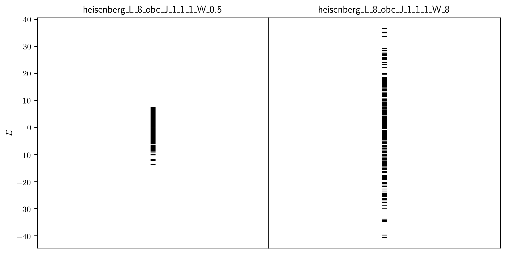
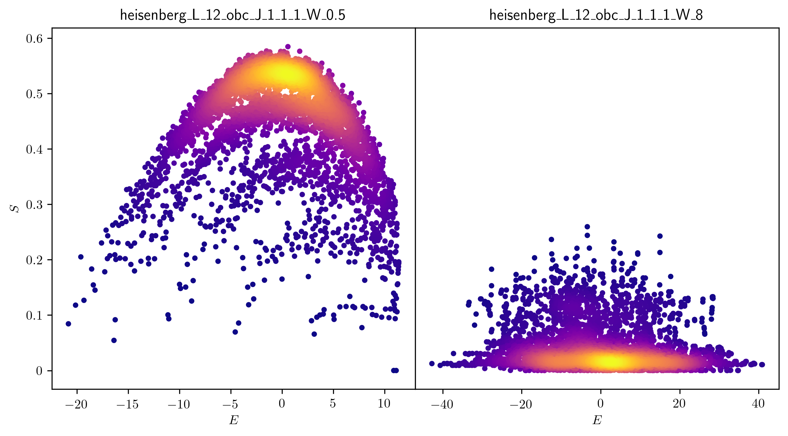
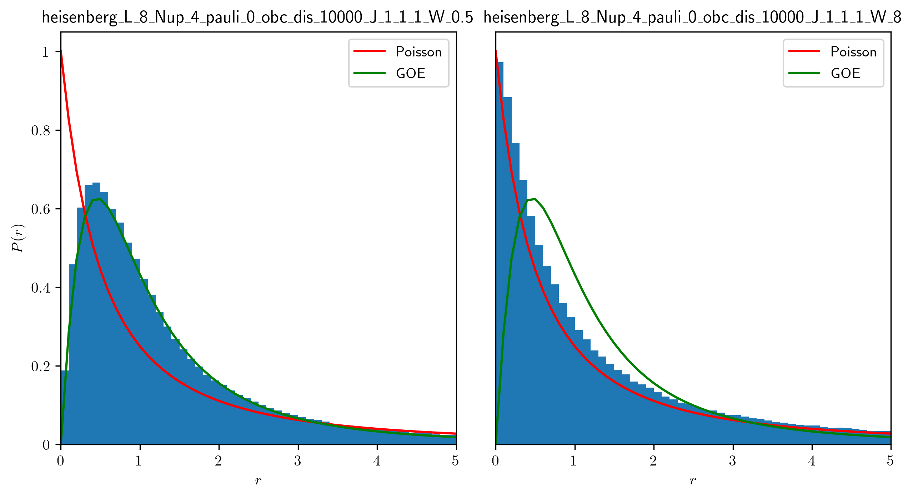
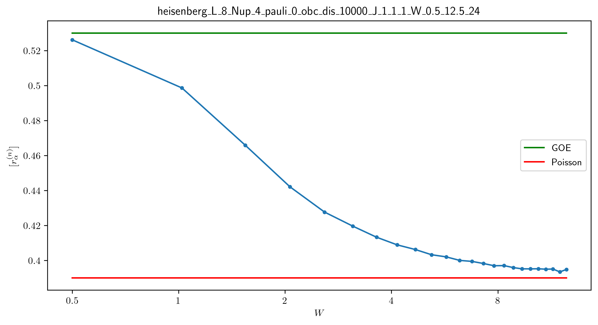
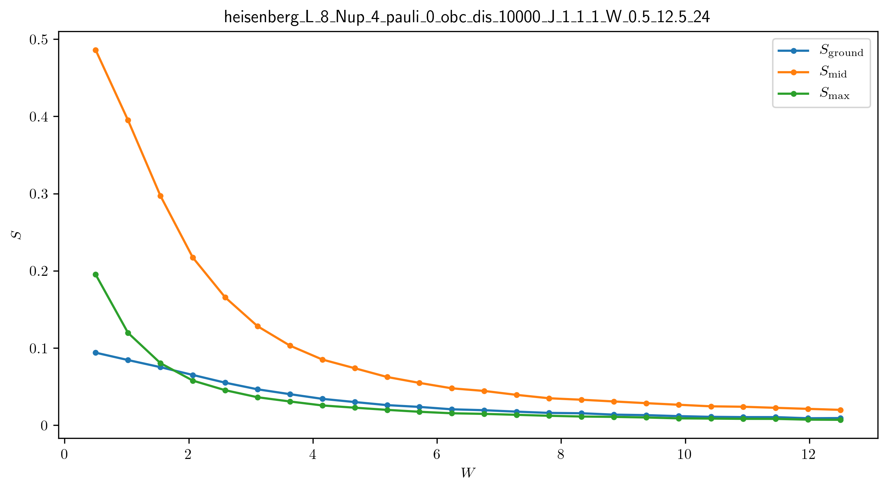
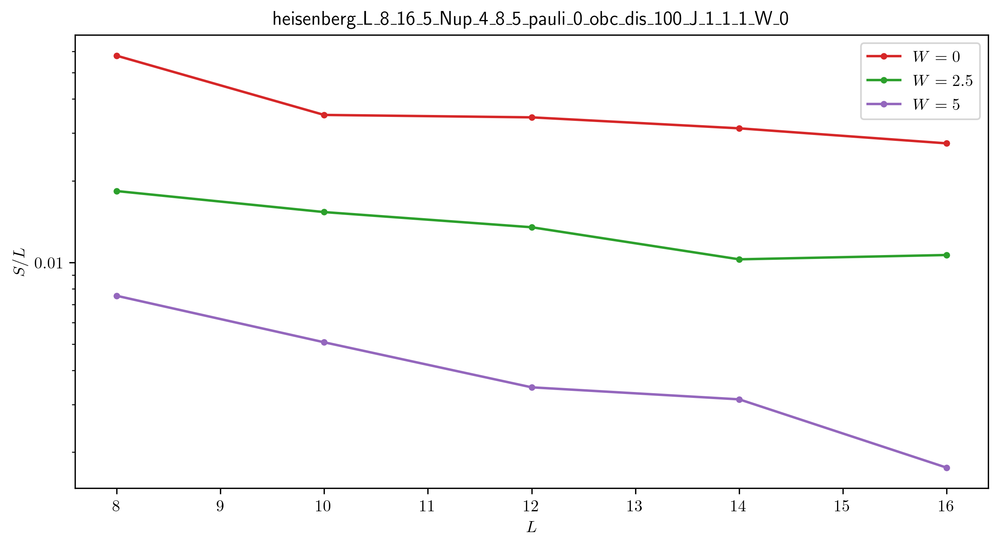
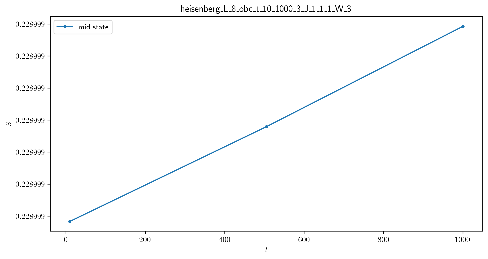

erg_loc
=======

A numerical toolbox to distinguish between ergodic and localized phases in quantum many-body systems.

Prerequisites: Python 3.7.6+, QuSpin 0.3.6+

Static Systems
--------------

The ``programs`` along with their corresponding ``tools``:

* **inst_ham** -- instantaneous Hamiltonian
	* ener -- disorder-averaged energy spectrum
	* ener_spac -- disorder-concatenated energy spacings
	* ent -- disorder-averaged entanglement entropy spectrum
	* ent_mid -- disorder-averaged entanglement entropy for a mid state only
* **W_flow** -- disorder evolution
	* ener_W_flow -- disorder-averaged energy spectrum against disorder amplitude
	* r_W_flow -- disorder-averaged first moment of the energy spacings against disorder amplitude
	* ent_W_flow -- disorder-averaged entanglement entropy spectrum against disorder amplitude
* **L_flow** -- length evolution
	* ent_mid_L_flow -- disorder-averaged entanglement entropy of a mid state against length
* **t_flow** -- time evolution
	* ent_t_flow -- disorder-averaged entanglement entropy of a given state against time

The ``plot`` scripts:

* **ener_spec** -- energy spectrum

* **ent_arc** -- entanglement entropy arc

* **ener_stat** -- energy spacing statistics

* **r_W_flow** -- first moment of the energy spacings disorder evolution (cf. Fig.3 of `[Pal2010] <https://arxiv.org/pdf/1010.1992.pdf>`__)

* **ent_W_flow** -- entanglement entropy disorder evolution

* **ent_mid_L_flow** -- entanglement entropy length evolution (cf. Fig.3c of `[Luitz2015] <https://arxiv.org/pdf/1411.0660.pdf>`__)

* **ent_t_flow** -- entanglement entropy time evolution (cf. Fig.2 of `[Nanduri2014] <https://arxiv.org/pdf/1404.5216.pdf>`__)

Driven Systems
--------------

Coming soon...

Hoffman2 Cluster
----------------

`Hoffman2 <https://schuang.github.io/hcat/index.html>`__ uses the Univa Grid Engine batch-queueing system on CentOS (Fedora/RHEL).

Programs to install:
^^^^^^^^^^^^^^^^^^^^

* `htop <https://htop.dev/>`__ -- allows you to view memory and CPU usage
* `parallel <https://www.gnu.org/software/parallel/>`__ -- allows you to conveniently parallelize jobs

Edits to ``~/.bash_profile``:
^^^^^^^^^^^^^^^^^^^^^^^^^^^^^

* ``export PATH=$PATH:$HOME/local/bin`` to access personal programs (installed above)
* ``export PYTHONUNBUFFERED='True'`` to view output of running python jobs in real time

Modules to load:
^^^^^^^^^^^^^^^^

* ``source /u/local/Modules/default/init/modules.sh``
* ``module load anaconda3``
* ``source /u/local/apps/anaconda3/2020.11/etc/profile.d/conda.sh``
* ``conda activate bart``

...where the anaconda path is found via...

* ``conda info | grep -i 'base environment'``

Alternatively, you can set up a conda environment in your home directory:

* ``conda init bash``
* ``conda env create --name bart --file=environment.yml``
* ``conda activate bart``

...then, once everything is set-up, you can simply source your bash configuration in the submission script instead:

* ``source /u/home/b/baandr12/.bash_profile``
* ``source /u/home/b/baandr12/.bashrc``

Useful commands:
^^^^^^^^^^^^^^^^

* ``module list`` -- list currently loaded modules
* ``module avail`` -- list available modules to load
* ``module load`` / ``module unload`` -- add or remove modules

* ``mygroup`` -- view accessible private resources
* ``myquota`` -- view my quota for home and scratch

* ``qhost`` -- view all cluster nodes
* ``qstat -U baandr12`` -- view all jobs running on the parts of cluster where I have access
* ``qstat -u baandr12`` -- view the status of my running jobs
* ``qstat -q bhaumik_pod.q`` -- status of bhaumik queue
* ``qstat -j 627506`` -- print the information for a particular job
* ``qsub srun.sh`` -- submit a script
* ``qdel 660385`` -- delete a job

Private resources:
^^^^^^^^^^^^^^^^^^

``bhaumik`` resource group currently has 8 intel-E5-2697 nodes, each with 32 cores and 512GB RAM

* ``qstat -q *.q@n{6..7}06{1..4}`` -- view all running jobs on bhaumik nodes (fast)
* ``qstat -f | sed -n -e '/q@n[6-7]06[1-4]/,/---/ p'`` -- view the full status of all bhaumik nodes (slow)

Example Commands
----------------

* ``python code/inst_ham.py -mod heisenberg -thr 1 -L 8 -bc o -dis 1 -W 0.5``
* ``python code/W_flow.py -mod heisenberg -L 8 -Nup 4 -pauli 0 -bc o -dis 10000 -W_min 0.5 -W_max 25 -W_samp 24``
* ``python code/L_flow.py -mod heisenberg -L_min 8 -L_max 12 -L_samp 3 -bc o -dis 10 -W 0``
* ``python code/t_flow.py -mod heisenberg -thr 1 -L 8 -t_min 10 -t_max 1000 -t_samp 3 -dis 1 -bc o -W 3``

References
----------

`[Pal2010] <https://arxiv.org/pdf/1010.1992.pdf>`__ "Many-body localization phase transition", by Arijeet Pal and David Huse, PRB **82**, 174411 (2010).

`[Luitz2015] <https://arxiv.org/pdf/1411.0660.pdf>`__ "Many-body localization edge in the random-field Heisenberg chain", by David Luitz, Nicolas Laflorencie, and Fabien Alet, PRB **91**, 081103(R) (2015).

`[Nanduri2014] <https://arxiv.org/pdf/1404.5216.pdf>`__ "Entanglement spreading in a many-body localized system", by Arun Nanduri, Hyungwon Kim, and David Huse, PRB **90**, 064201 (2014).
