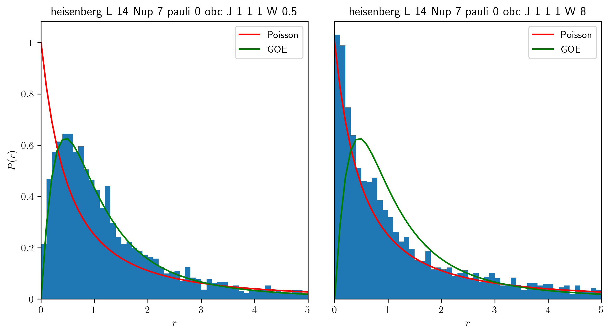

erg_loc
=======

A numerical toolbox to distinguish between ergodic and localized phases in quantum many-body systems.

Prerequisites: Python 3.7.6+, QuSpin 0.3.6+

Static Systems
--------------

The ``programs`` along with their corresponding ``tools``:

* **inst_ham** -- instantaneous Hamiltonian
	* ener_spec -- energy spectrum
	* ent_spec -- entanglement entropy spectrum
* **W_flow** -- disorder evolution
	* ener_W_flow -- energy disorder evolution
	* ent_W_flow -- entanglement entropy disorder evolution
* **t_flow** -- time evolution
	* ener_t_flow -- energy time evolution
	* ent_t_flow -- entanglement entropy time evolution

The ``plot`` scripts:

* **ener_spec** -- energy spectrum

.. image:: figures/ener_spec/heisenberg/ener_spec_heisenberg_L_8_obc_J_1_1_1_W_0.5_comparison.png
	:align: center
	:width: 80%

* **ent_arc** -- entanglement entropy arc

.. image:: figures/ent_arc/heisenberg/ent_arc_heisenberg_L_12_obc_J_1_1_1_W_0.5_comparison.png
	:align: center
	:width: 80%

* **ener_stat** -- energy spacing statistics

Driven Systems
--------------

Coming soon...

Example Command
---------------

``python code/inst_ham.py -mod heisenberg -thr 1 -L 8 -bc o -dis 1 -W 0.5``
