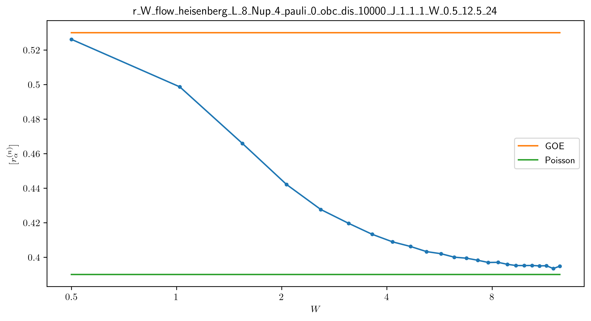
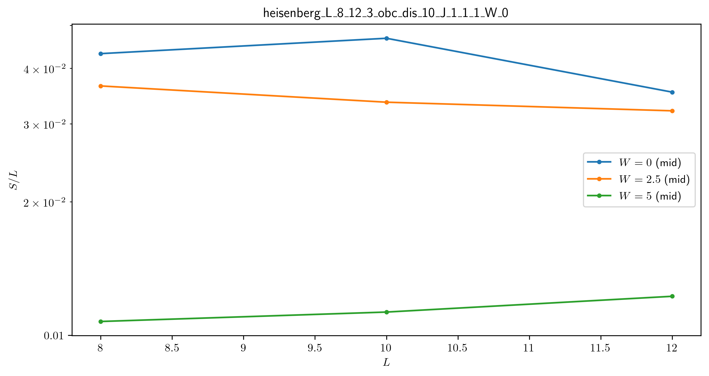

erg_loc
=======

A numerical toolbox to distinguish between ergodic and localized phases in quantum many-body systems.

Prerequisites: Python 3.7.6+, QuSpin 0.3.6+

Static Systems
--------------

The ``programs`` along with their corresponding ``tools``:

* **inst_ham** -- instantaneous Hamiltonian
	* ener -- disorder-averaged energy spectrum
	* ener_spac -- disorder-concatenated energy spacings
	* ent -- disorder-averaged entanglement entropy spectrum
* **W_flow** -- disorder evolution
	* ener_W_flow -- disorder-averaged energy spectrum against disorder amplitude
	* r_W_flow -- disorder-averaged first moment of the energy spacings against disorder amplitude
	* ent_W_flow -- disorder-averaged entanglement entropy spectrum against disorder amplitude
* **L_flow** -- length evolution
	* ener_L_flow -- disorder-averaged energy spectrum against length
	* ent_L_flow -- disorder-averaged entanglement entropy spectrum against length
* **t_flow** -- time evolution
	* ent_t_flow -- disorder-averaged entanglement entropy of given state against time

The ``plot`` scripts:

* **ener_spec** -- energy spectrum

.. image:: figures/ener_spec/heisenberg/ener_spec_heisenberg_L_8_obc_J_1_1_1_W_0.5_comparison.png
	:align: center
	:width: 80%

* **ent_arc** -- entanglement entropy arc

.. image:: figures/ent_arc/heisenberg/ent_arc_heisenberg_L_12_obc_J_1_1_1_W_0.5_comparison.png
	:align: center
	:width: 80%

* **ener_stat** -- energy spacing statistics

.. image:: figures/ener_stat/heisenberg/ener_stat_heisenberg_L_8_Nup_4_pauli_0_obc_dis_10000_J_1_1_1_W_0.5_comparison.png
	:align: center
	:width: 80%

* **ener_stat_W_flow** -- energy spacing statistics disorder evolution (cf. Fig.3 of [Pal2010])

* **ent_W_flow** -- entanglement entropy disorder evolution

.. image:: figures/ent_W_flow/heisenberg/ent_W_flow_heisenberg_L_8_Nup_4_pauli_0_obc_dis_10000_J_1_1_1_W_0.5_12.5_24.png
	:align: center
	:width: 80%

* **ent_L_flow** -- entanglement entropy length evolution (cf. Fig.3c of [Luitz2015])

* **ent_t_flow** -- entanglement entropy time evolution (cf. Fig.2 of [Nanduri2014])

.. image:: figures/ent_t_flow/heisenberg/ent_t_flow_heisenberg_L_8_obc_t_10_1000_3_J_1_1_1_W_3.png
	:align: center
	:width: 80%

Driven Systems
--------------

Coming soon...

Hoffman2 Cluster
----------------

`Hoffman2 <https://schuang.github.io/hcat/index.html>`__ uses the Univa Grid Engine batch-queueing system on CentOS (Fedora/RHEL).

Programs to install:

* `htop <https://htop.dev/>`__ -- allows you to view memory and CPU usage
* `parallel <https://www.gnu.org/software/parallel/>`__ -- allows you to conveniently parallelize jobs

Edits to ``~/.bash_profile``:

* ``export PATH=$PATH:$HOME/local/bin`` to access personal programs
* ``export PYTHONUNBUFFERED='True'`` to view granular output of running python jobs

Modules to load:

* anaconda3 (currently python 3.8.5)

Useful commands:

* ``module list`` -- list currently loaded modules
* ``module avail`` -- list available modules to load
* ``module load`` / ``module unload`` -- add or remove modules

* ``mygroup`` -- view accessible private resources
* ``myquota`` -- view my quota for home and scratch

* ``qhost`` -- view all cluster nodes
* ``qstat -U baandr12`` -- view all jobs running on the parts of cluster where I have access
* ``qstat -u baandr12`` -- view the status of my running jobs
* ``qstat -q bhaumik_pod.q`` -- status of bhaumik queue
* ``qstat -j 627506`` -- print the information for a particular job

Private resources:

* ``bhaumik`` resource group currently has 8 nodes, each with 32 cores and 512GB RAM

Example Command
---------------

``python code/inst_ham.py -mod heisenberg -thr 1 -L 8 -bc o -dis 1 -W 0.5``

References
----------

[Pal2010] "Many-body localization phase transition" by Arijeet Pal and David Huse, PRB **82**, 174411 (2010).

[Luitz2015] "Many-body localization edge in the random-field Heisenberg chain", by David Luitz, Nicolas Laflorencie, and Fabien Alet, PRB **91**, 081103(R) (2015).

[Nanduri2014] "Entanglement spreading in a many-body localized system", by Arun Nanduri, Hyungwon Kim, and David Huse, PRB **90**, 064201 (2014).
