erg_loc
=======

A numerical toolbox to distinguish between ergodic and localized phases in quantum many-body systems.

Prerequisites: Python 3.7.6+, QuSpin 0.3.6+

1. `Static Systems`_
2. `Driven Systems`_
3. `Hoffman2 Cluster`_
4. `References`_

Static Systems
--------------

The ``programs`` along with their corresponding ``tools``:

* **inst_ham** -- instantaneous Hamiltonian
	* ener -- disorder-averaged energy spectrum
	* ener_spac -- disorder-concatenated energy spacings
	* ent -- disorder-averaged entanglement entropy spectrum
	* ent_mid* -- disorder-averaged entanglement entropy for a mid state only
	* overlap -- disorder-averaged overlap spectrum
	* exp_val -- disorder-averaged expectation value spectrum
* **W_flow** -- disorder evolution
	* ener_W_flow -- disorder-averaged energy spectrum against disorder amplitude
	* r_W_flow -- disorder-averaged first moment of the energy spacings against disorder amplitude
	* ent_W_flow -- disorder-averaged entanglement entropy spectrum against disorder amplitude
	* ent_rel_W_flow -- disorder-averaged relative entropy against disorder amplitude
* **L_flow** -- length evolution
	* ent_L_flow* -- disorder-averaged entanglement entropy spectrum against length
	* ent_mid_L_flow* -- disorder-averaged entanglement entropy of a mid state against length
* **t_flow** -- time evolution
	* ent_t_flow -- disorder-averaged entanglement entropy of a given state against time
	* numb_fluc_t_flow -- disorder-averaged particle number fluctuations against time
	* overlap_t_flow -- disorder-averaged overlap against time

*mutually exclusive tools

The ``plot`` scripts:

* **ener_spec** -- energy spectrum

``python code/inst_ham.py -mod heisenberg -thr 1 -L 8 -bc o -dis 1 -W 0.5``

``python code/inst_ham.py -mod heisenberg -thr 1 -L 8 -bc o -dis 1 -W 8``

.. image:: figures/ener_spec/heisenberg/ener_spec_heisenberg_L_8_obc_J_1_1_1_W_0.5_comparison.png
	:align: center
	:width: 80%

* **ent_arc** -- entanglement entropy arc

``python code/inst_ham.py -mod heisenberg -thr 1 -L 12 -bc o -dis 1 -W 0.5``

``python code/inst_ham.py -mod heisenberg -thr 1 -L 12 -bc o -dis 1 -W 8``

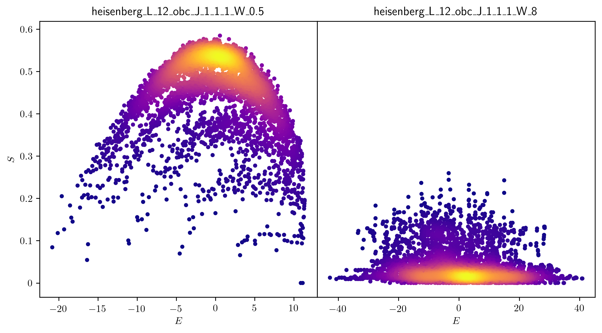

* **ener_stat** -- energy spacing statistics

``python code/inst_ham.py -mod heisenberg -Nup 4 -pauli 0 -L 8 -bc o -dis 10000 -W 0.5``

``python code/inst_ham.py -mod heisenberg -Nup 4 -pauli 0 -L 8 -bc o -dis 10000 -W 8``

.. image:: figures/ener_stat/heisenberg/ener_stat_heisenberg_L_8_Nup_4_pauli_0_obc_dis_10000_J_1_1_1_W_0.5_comparison.png
	:align: center
	:width: 80%

* **overlap_spec** -- overlap-eigenenergy spectrum (cf. Fig.3b of `[Turner2018] <https://arxiv.org/abs/1806.10933>`__)

``python code/inst_ham.py -mod pxp -L 18 -bc o``

``python code/inst_ham.py -mod pxp -L 20 -bc o``

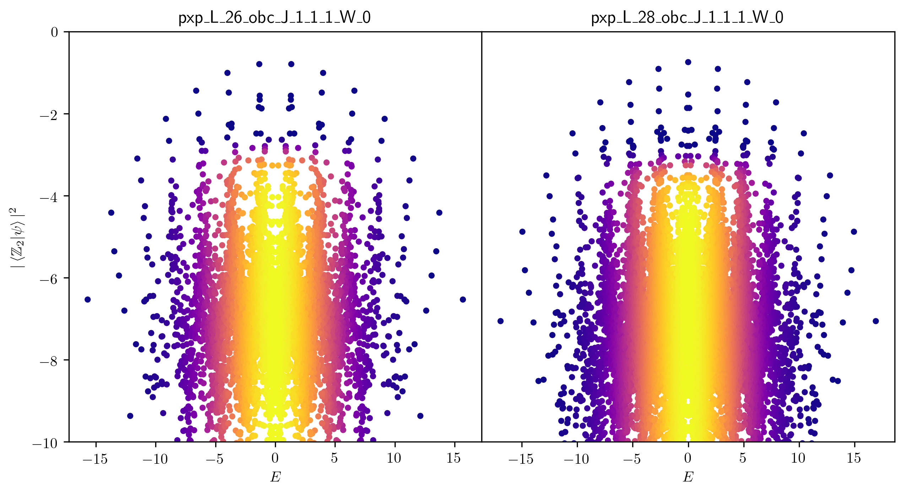

* **overlap_stat** -- overlap statistics (cf. Fig.2b of `[Turner2018] <https://arxiv.org/abs/1806.10933>`__)

``python code/inst_ham.py -mod pxp -L 10 -bc o``

``python code/inst_ham.py -mod pxp -L 12 -bc o``

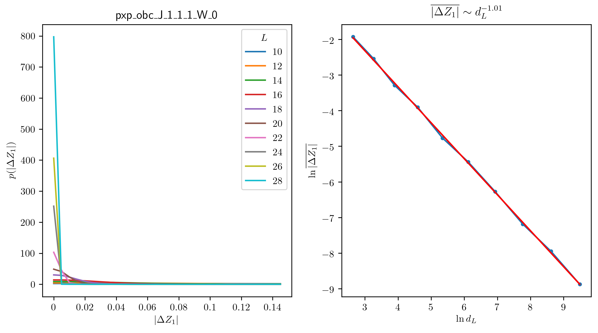

* **eth_arc** -- eigenstate thermalization hypothesis arc (cf. Fig.2a of `[Turner2018] <https://arxiv.org/abs/1806.10933>`__)

``python code/inst_ham.py -mod pxp -L 26 -bc o``

``python code/inst_ham.py -mod pxp -L 28 -bc o``

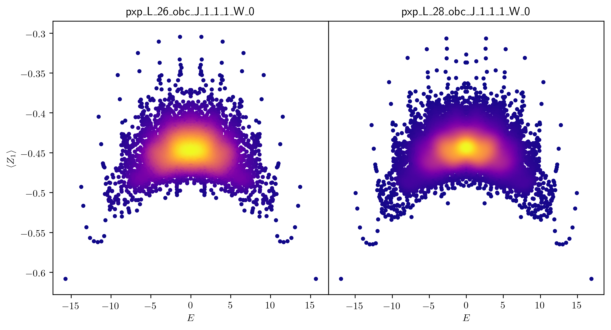

* **scar_gap_scal** -- scar state energy gap scaling (cf. Fig.4 of `[Turner2018] <https://arxiv.org/abs/1806.10933>`__)

``python code/inst_ham.py -mod pxp -L 10 -bc o``

``python code/inst_ham.py -mod pxp -L 12 -bc o``

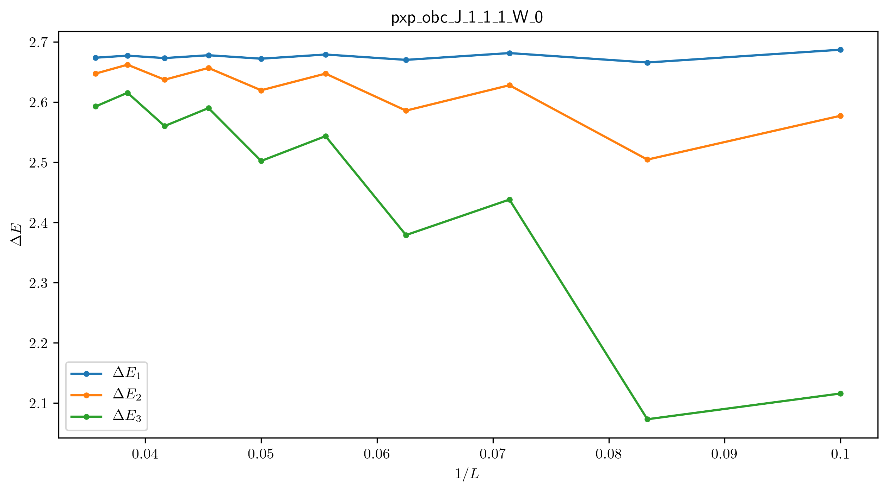

* **r_W_flow** -- first moment of the energy spacings disorder evolution (cf. Fig.3 of `[Pal2010] <https://arxiv.org/pdf/1010.1992.pdf>`__)

``python code/W_flow.py -mod heisenberg -L 8 -Nup 4 -pauli 0 -bc o -dis 11000 -W_min 0.5 -W_max 12.5 -W_samp 24``

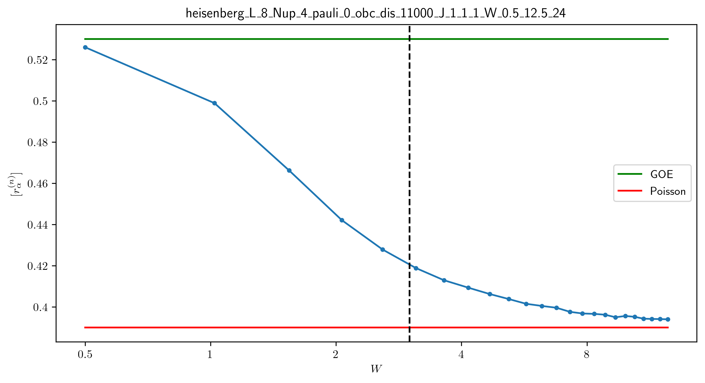

* **ent_W_flow** -- entanglement entropy disorder evolution

``python code/W_flow.py -mod heisenberg -L 8 -Nup 4 -pauli 0 -bc o -dis 10000 -W_min 0.5 -W_max 12.5 -W_samp 24``

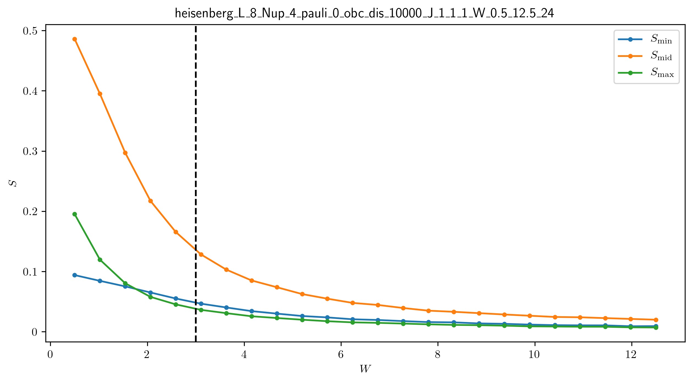

* **ent_rel_W_flow** -- relative entropy disorder evolution (cf. Fig.2b of `[Luitz2015] <https://arxiv.org/pdf/1411.0660.pdf>`__)

``python code/W_flow.py -mod heisenberg -L 8 -Nup 4 -pauli 0 -bc o -dis 1000 -W_min 0.2 -W_max 4.9 -W_samp 23``

``python code/W_flow.py -mod heisenberg -L 10 -Nup 5 -pauli 0 -bc o -dis 1000 -W_min 0.2 -W_max 4.9 -W_samp 23``

``python code/W_flow.py -mod heisenberg -L 12 -Nup 6 -pauli 0 -bc o -dis 1000 -W_min 0.2 -W_max 4.9 -W_samp 23``

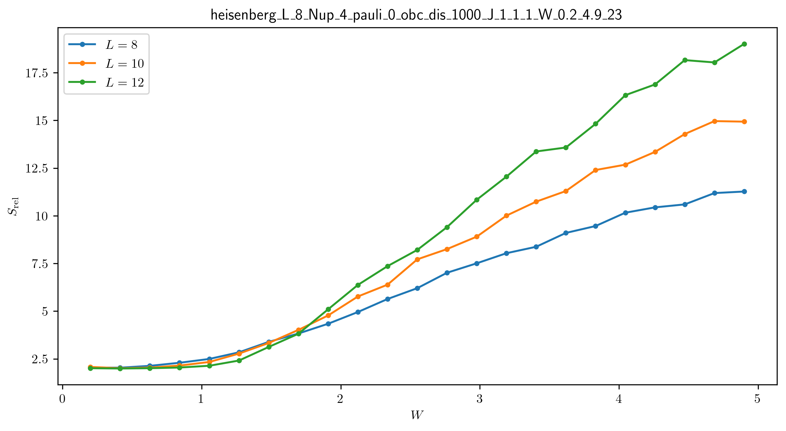

* **ent_mid_L_flow** -- entanglement entropy length evolution (cf. Fig.3c of `[Luitz2015] <https://arxiv.org/pdf/1411.0660.pdf>`__)

``python code/L_flow.py -mod heisenberg -L_min 12 -L_max 16 -L_samp 3 -Nup_min 6 -Nup_max 8 -pauli 0 -bc o -dis 100 -W 0.5``

``python code/L_flow.py -mod heisenberg -L_min 12 -L_max 16 -L_samp 3 -Nup_min 6 -Nup_max 8 -pauli 0 -bc o -dis 100 -W 8``

.. image:: figures/ent_mid_L_flow/heisenberg/ent_mid_L_flow_heisenberg_L_12_16_3_Nup_6_8_3_pauli_0_obc_dis_100_J_1_1_1_W_0.5_comparison_original.png
	:align: center
	:width: 80%

* **ent_t_flow** -- entanglement entropy time evolution (cf. Fig.2 of `[Nanduri2014] <https://arxiv.org/pdf/1404.5216.pdf>`__)

With ``v=0`` in the initial Bloch state.

``python code/t_flow.py -mod heisenberg -L 6 -J 1 1 0.2 -t_min -1 -t_max 6 -t_samp 100 -dis 100 -bc o -W 0.5``

``python code/t_flow.py -mod heisenberg -L 6 -J 1 1 0.2 -t_min -1 -t_max 6 -t_samp 100 -dis 100 -bc o -W 10``

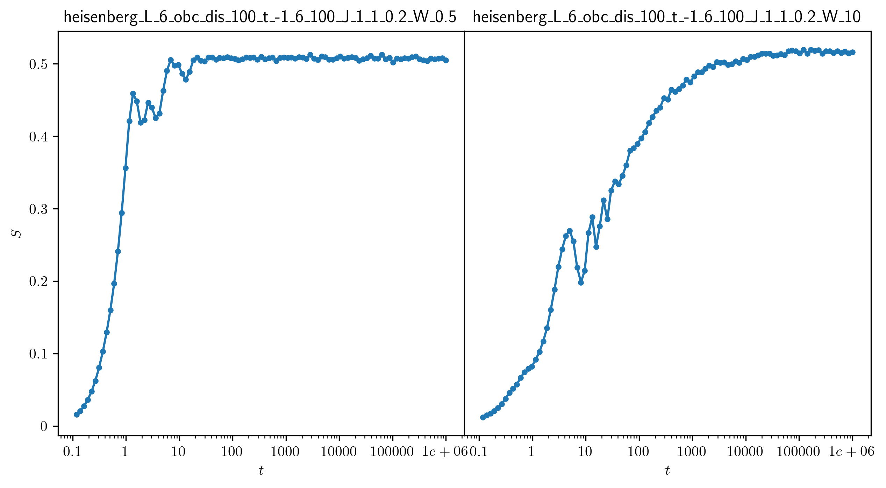

* **numb_fluc_t_flow** -- particle number fluctuation time evolution (cf. Fig.2a of `[Bardarson2012] <https://arxiv.org/abs/1202.5532>`__)

With ``v=1`` in the initial Bloch state.

``python code/t_flow.py -mod heisenberg -L 8 -pauli 0 -J 1 1 0 -t_min -2 -t_max 3 -t_samp 50 -dis 1000 -bc o -W 5 -tag ".v_1"``

``python code/t_flow.py -mod heisenberg -L 8 -pauli 0 -J 1 1 0.2 -t_min -2 -t_max 3 -t_samp 50 -dis 1000 -bc o -W 5 -tag ".v_1"``

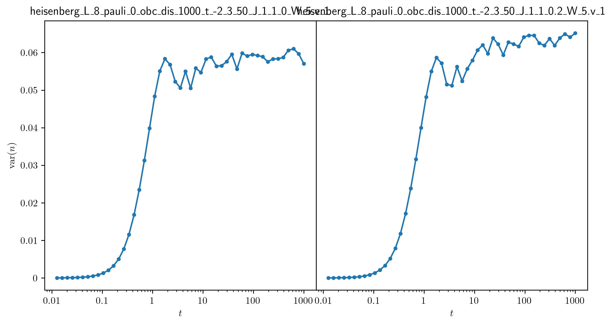

* **overlap_t_flow** -- overlap time evolution (cf. Fig.6 of `[Turner2018] <https://arxiv.org/abs/1806.10933>`__)

``python code/t_flow.py -mod pxp -L 24 -bc o -t_min 0 -t_max 30 -t_samp 1000 -tag ".Z2"``

``python code/t_flow.py -mod pxp -L 24 -bc o -t_min 0 -t_max 30 -t_samp 1000 -tag ".Z3"``

``python code/t_flow.py -mod pxp -L 24 -bc o -t_min 0 -t_max 30 -t_samp 1000 -tag ".Z4"``

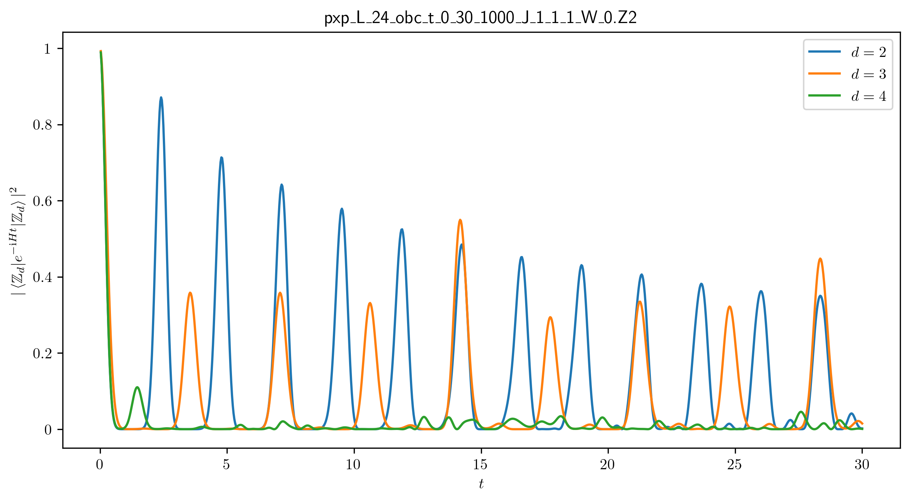

Driven Systems
--------------

The ``programs`` along with their corresponding ``tools``:

* **inst_U** -- instantaneous Floquet unitary
	* q_ener -- disorder-averaged quasi-energy spectrum
	* q_ener_spac -- disorder-concatenated quasi-energy spacings
	* floq_struc -- disorder-averaged Floquet eigenstate structure
	* loc_len -- disorder-averaged localization length per Floquet eigenstate
* **N_flow** -- Floquet cycle evolution
	* ener_abs_N_flow -- disorder-averaged energy absorbed against N
	* ent_N_flow -- disorder-averaged entanglement entropy against N
	* info_ent_N_flow* -- disorder-averaged Floquet-eigenstate-average information entropy against N
* **T_flow** -- Floquet time evolution
	* PR_T_flow -- disorder-averaged Floquet-eigenstate-average participation ratio against T
* **delta_flow** -- drive period evolution
	* q_ener_delta_flow -- disorder-averaged quasi-energy spectrum against delta
	* loc_len_delta_flow -- disorder-averaged Floquet-eigenstate-averaged localization length against delta
	* PR_delta_flow -- disorder-averaged Floquet-eigenstate-average participation ratio against delta
	* ent_delta_flow* -- disorder-averaged entanglement entropy against delta
* **L_flow** -- length evolution
	* ent_L_flow* -- disorder-averaged entanglement entropy against length
	* ent_mid_L_flow* -- disorder-averaged entanglement entropy of a mid state against length

*mutually exclusive tools

The ``plot`` scripts:

* **q_ener_spec** -- quasi-energy spectrum

``python code/inst_U.py -mod ponte2015 -L 8 -pauli 0 -bc o -W 0.5 -h0 2 -T0 7 -T1 1.5``

``python code/inst_U.py -mod ponte2015 -L 8 -pauli 0 -bc o -W 8 -h0 2 -T0 7 -T1 1.5``

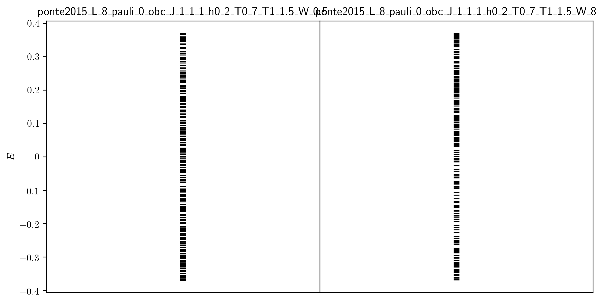

* **q_ener_stat** -- quasi-energy spacing statistics

``python code/inst_U.py -mod ponte2015 -L 8 -Nup 4 -pauli 0 -bc o -W 0.5 -h0 2 -T0 7 -T1 1.5 -dis 10000``

``python code/inst_U.py -mod ponte2015 -L 8 -Nup 4 -pauli 0 -bc o -W 0.5 -h0 2 -T0 7 -T1 1.5 -dis 10000``

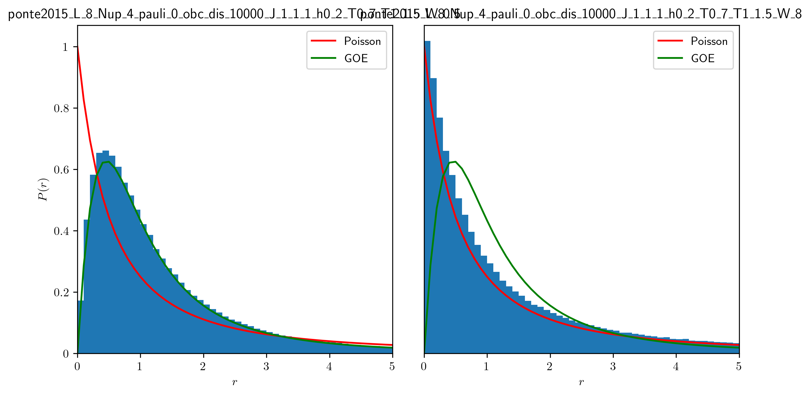

* **floq_struc** -- Floquet eigenstate structure (cf. Fig.2a of `[Ponte2015] <https://arxiv.org/abs/1403.6480>`__)

``python code/inst_U.py -mod ponte2015 -L 8 -pauli 0 -bc o -W 0.5 -h0 2 -T0 7 -T1 1.5``

``python code/inst_U.py -mod ponte2015 -L 8 -pauli 0 -bc o -W 8 -h0 2 -T0 7 -T1 1.5``

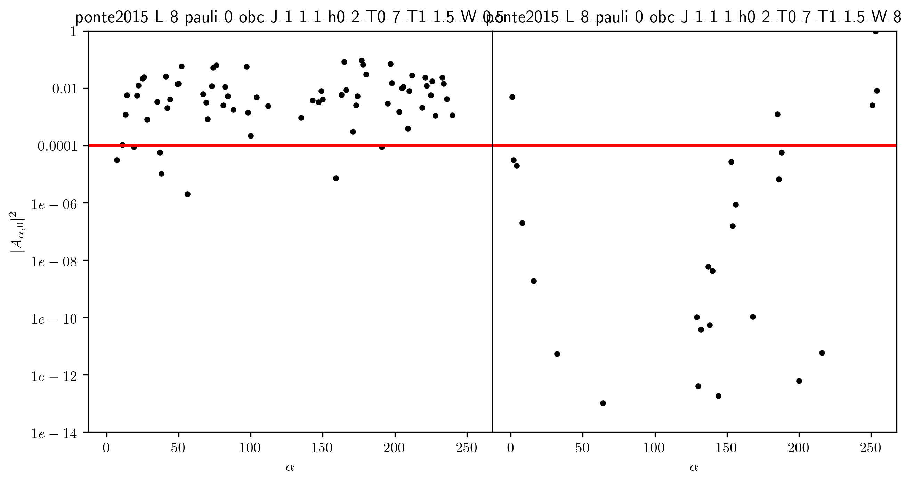

* **ener_abs_N_flow** -- energy absorbed N evolution (cf. Fig.2c of `[Ponte2015] <https://arxiv.org/abs/1403.6480>`__)

``python code/N_flow.py -mod ponte2015 -L 8 -pauli 0 -bc o -W 0.5 -h0 2 -T0 7 -T1 1.5 -N 31 -dis 100``

``python code/N_flow.py -mod ponte2015 -L 8 -pauli 0 -bc o -W 8 -h0 2 -T0 7 -T1 1.5 -N 31 -dis 100``

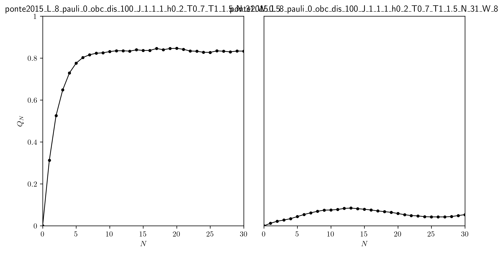

* **ent_N_flow** -- entanglement entropy N evolution

With ``v=0`` in the initial Bloch state.

``python code/N_flow.py -mod spin2021 -L 8 -bc o -W 2 -T0 1 -T1 1 -N 201 -dis 10 -delta 0.9``

``python code/N_flow.py -mod spin2021 -L 8 -bc o -W 2 -T0 1 -T1 1 -N 201 -dis 10 -delta 0.1``

.. image:: figures/ent_N_flow/spin2021/ent_N_flow_spin2021_L_8_obc_dis_10_J_1_1_1_T0_1_T1_1_N_1001_delta_0.9_W_2_comparison.png
	:align: center
	:width: 80%

* **ent_info_N_flow** -- information entropy N evolution (cf. Fig.4 of `[DAlessio2014] <https://arxiv.org/abs/1402.5141>`__)

``python code/N_flow.py -mod spin2021 -L 400 -Nup 1 -bc o -W 2 -T0 1 -T1 1 -N 60 -dis 10 -delta 0.9``

``python code/N_flow.py -mod spin2021 -L 400 -Nup 1 -bc o -W 2 -T0 1 -T1 1 -N 60 -dis 10 -delta 0.1``

.. image:: figures/ent_info_N_flow/spin2021/ent_info_N_flow_spin2021_L_400_Nup_1_obc_dis_10_J_1_1_1_T0_1_T1_1_N_60_delta_0.9_W_2_comparison.png
	:align: center
	:width: 80%

* **PR_T_flow** -- participation ratio T evolution (cf. Fig.2b of `[Ponte2015] <https://arxiv.org/abs/1403.6480>`__)

``python code/T_flow.py -mod ponte2015 -pauli 0 -L 8 -h0 2 -T0 7 -dis 5 -bc o -W 0.5 -T_min 0 -T_max 3 -T_samp 16``

``python code/T_flow.py -mod ponte2015 -pauli 0 -L 8 -h0 2 -T0 7 -dis 5 -bc o -W 8 -T_min 0 -T_max 3 -T_samp 16``

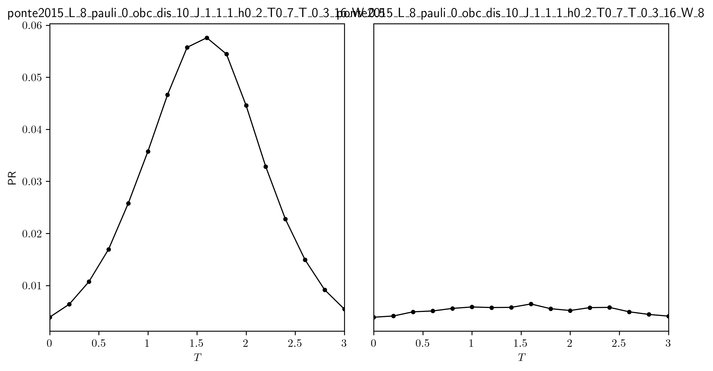

* **q_ener_delta_flow** -- quasi-energy spectrum delta evolution

``python code/delta_flow.py -mod spin2021 -Nup 1 -L 20 -bc o -T0 1 -T1 1 -W 0 -delta_min 0 -delta_max 1 -delta_samp 24``

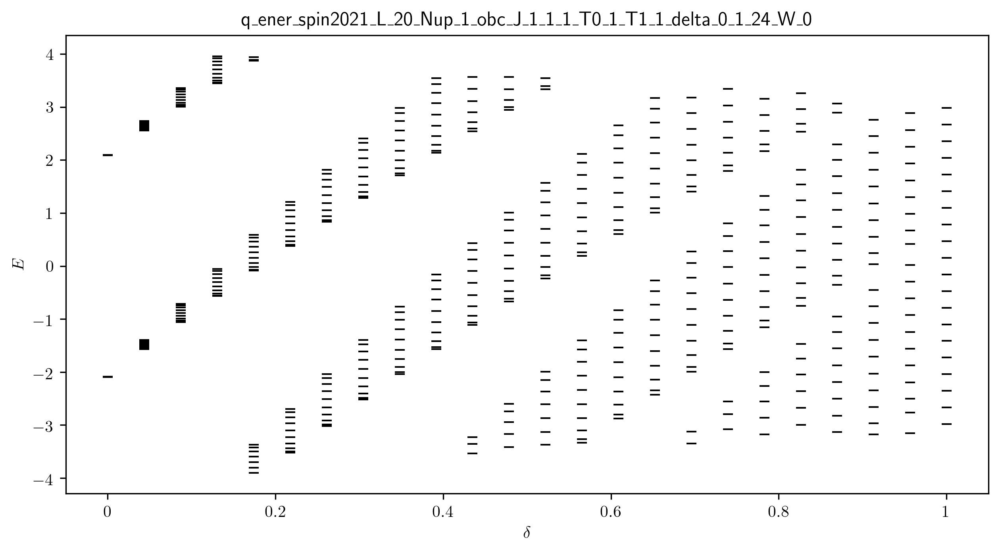

* **loc_len_delta_flow** -- localization length delta evolution

``python code/delta_flow.py -mod spin2021 -dis 10 -Nup 1 -L 200 -bc o -T0 1 -T1 1 -W 1 -delta_min 0 -delta_max 1 -delta_samp 11``

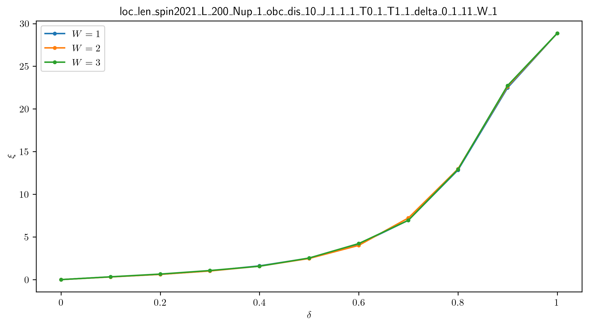

* **PR_delta_flow** -- participation ratio delta evolution

``python code/delta_flow.py -mod spin2021 -dis 10 -Nup 1 -L 100 -bc o -T0 1 -T1 1 -W 2 -delta_min 0 -delta_max 1 -delta_samp 21``

``python code/delta_flow.py -mod spin2021 -dis 10 -Nup 1 -L 200 -bc o -T0 1 -T1 1 -W 2 -delta_min 0 -delta_max 1 -delta_samp 21``

``python code/delta_flow.py -mod spin2021 -dis 10 -Nup 1 -L 300 -bc o -T0 1 -T1 1 -W 2 -delta_min 0 -delta_max 1 -delta_samp 21``

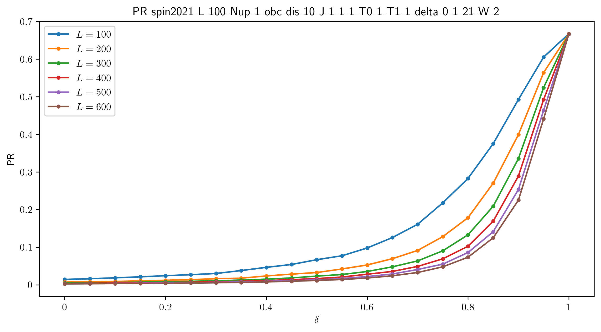

* **ent_delta_flow** -- entanglement entropy delta evolution

``python code/delta_flow.py -mod spin2021 -dis 100 -L 12 -bc o -T0 1 -T1 1 -W 2 -delta_min 0 -delta_max 1 -delta_samp 11``

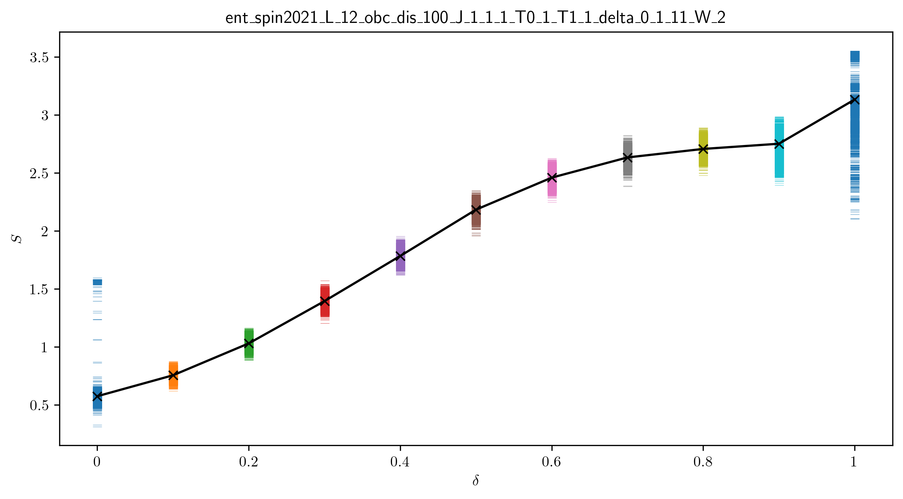

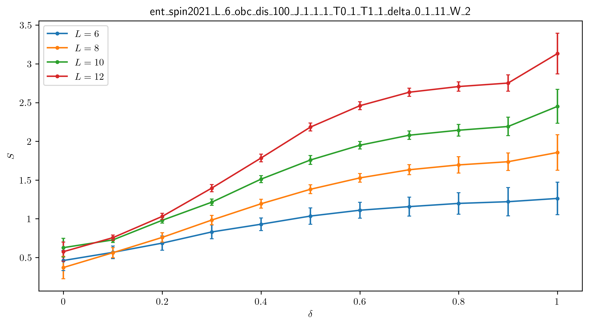

* **ent_L_flow** -- entanglement entropy length evolution

``python code/L_flow.py -mod spin2021 -L_min 6 -L_max 12 -L_samp 4 -bc o -dis 100 -T0 1 -T1 1 -delta 0.1 -W 2``

.. image:: figures/ent_L_flow/spin2021/ent_L_flow_spin2021_L_6_12_4_obc_dis_100_J_1_1_1_T0_1_T1_1_delta_0.1_W_2_comparison.png
	:align: center
	:width: 80%

Hoffman2 Cluster
----------------

`Hoffman2 <https://schuang.github.io/hcat/index.html>`__ uses the Univa Grid Engine batch-queueing system on CentOS (Fedora/RHEL).

Programs to install:
^^^^^^^^^^^^^^^^^^^^

* `htop <https://htop.dev/>`__ -- allows you to view memory and CPU usage
* `parallel <https://www.gnu.org/software/parallel/>`__ -- allows you to conveniently parallelize jobs

Edits to ``~/.bash_profile``:
^^^^^^^^^^^^^^^^^^^^^^^^^^^^^

* ``export PATH=$PATH:$HOME/local/bin`` to access personal programs (installed above)
* ``export PYTHONUNBUFFERED='True'`` to view output of running python jobs in real time

Modules to load:
^^^^^^^^^^^^^^^^

* ``source /u/local/Modules/default/init/modules.sh``
* ``module load anaconda3``
* ``source /u/local/apps/anaconda3/2020.11/etc/profile.d/conda.sh``
* ``conda activate bart``

...where the anaconda path is found via...

* ``conda info | grep -i 'base environment'``

Alternatively, you can set up a conda environment in your home directory:

* ``conda init bash``
* ``conda env create --name bart --file=environment.yml``
* ``conda activate bart``

...then, once everything is set-up, you can simply source your bash configuration in the submission script instead:

* ``source /u/home/b/baandr12/.bash_profile``
* ``source /u/home/b/baandr12/.bashrc``

Useful commands:
^^^^^^^^^^^^^^^^

* ``module list`` -- list currently loaded modules
* ``module avail`` -- list available modules to load
* ``module load`` / ``module unload`` -- add or remove modules

* ``mygroup`` -- view accessible private resources
* ``myquota`` -- view my quota for home and scratch

* ``qhost`` -- view all cluster nodes
* ``qstat -U baandr12`` -- view all jobs running on the parts of cluster where I have access
* ``qstat -u baandr12`` -- view the status of my running jobs
* ``qstat -q bhaumik_pod.q`` -- status of bhaumik queue
* ``qstat -j 627506`` -- print the information for a particular job
* ``qsub srun.sh`` -- submit a script
* ``qdel 660385`` -- delete a job

Private resources:
^^^^^^^^^^^^^^^^^^

``bhaumik`` resource group currently has 8 intel-E5-2697 nodes, each with 32 cores and 512GB RAM

* ``qstat -q *.q@n{6..7}06{1..4}`` -- view all running jobs on bhaumik nodes (fast)
* ``qstat -f | sed -n -e '/q@n[6-7]06[1-4]/,/---/ p'`` -- view the full status of all bhaumik nodes (slow)

References
----------

`[Pal2010] <https://arxiv.org/pdf/1010.1992.pdf>`__ "Many-body localization phase transition", by Arijeet Pal and David Huse, PRB **82**, 174411 (2010).

`[Luitz2015] <https://arxiv.org/pdf/1411.0660.pdf>`__ "Many-body localization edge in the random-field Heisenberg chain", by David Luitz, Nicolas Laflorencie, and Fabien Alet, PRB **91**, 081103(R) (2015).

`[Nanduri2014] <https://arxiv.org/pdf/1404.5216.pdf>`__ "Entanglement spreading in a many-body localized system", by Arun Nanduri, Hyungwon Kim, and David Huse, PRB **90**, 064201 (2014).

`[Ponte2015] <https://arxiv.org/abs/1403.6480>`__ "Periodically driven ergodic and many-body localized quantum systems"  by Pedro Ponte, Anushya Chandran, Zlatko Papić, and Dmitry Abanin, Annals of Physics **353**, 196 (2015).

`[DAlessio2014] <https://arxiv.org/abs/1402.5141>`__ "Long-time Behavior of Isolated Periodically Driven Interacting Lattice Systems"  by Luca D’Alessio and Marcos Rigol, PRX **4**, 041048 (2014).

`[Bardarson2012] <https://arxiv.org/abs/1202.5532>`__ "Unbounded growth of entanglement in models of many-body localization" by Jens Bardarson, Frank Pollmann, Joel Moore, PRL **109**, 017202 (2012).

`[Turner2018] <https://arxiv.org/abs/1806.10933>`__ "Quantum scarred eigenstates in a Rydberg atom chain: entanglement, breakdown of thermalization, and stability to perturbations", PRB **98**, 155134 (2018).
